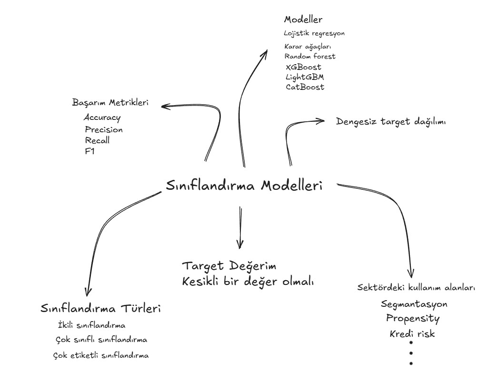

# Sınıflandırma Modelleri - Eğitim Notları

## 1. Sınıflandırma Nedir?

### Target Değişkenin Kesikli Olması
- Machine learning'de bir problemin sınıflandırma problemi olabilmesi için **target (hedef) değişkenin kesikli olması** gerekir
- **Kesikli değişken**: Kategorik veya sınırlı sayıda değer alan değişkenler
- **Sürekli değişken**: Aralıklarda sonsuz değer alabilen değişkenler (regresyon için)

### Regresyon vs Sınıflandırma
- **Regresyon**: Target sürekli sayısal değerler (örn: maaş, fiyat)
- **Sınıflandırma**: Target kesikli değerler (örn: düşük/orta/yüksek maaş)
- Bir regresyon problemi kategori bazlı gruplandırılarak sınıflandırmaya çevrilebilir

---

## 2. Sınıflandırma Türleri

### İkili Sınıflandırma (Binary Classification)
- Target'ta sadece 2 değer var: 1/0, Evet/Hayır, Elma/Armut
- Model bir olasılık çıkarır, threshold'a göre sınıf atanır
- Threshold üstü → 1, threshold altı → 0
- Sektörde en yaygın kullanılan tür

### Çok Sınıflı Sınıflandırma (Multi-class Classification)
- Target'ta ikiden fazla sınıf var
- Örnekler: Elma/Armut/Ayva, Farklı meyve türleri, Dil tespiti
- Sınıf sayısı probleme göre değişir

### Çok Etiketli Sınıflandırma (Multi-label Classification)
- Bir örnek birden fazla etikete sahip olabilir
- Örnekler: Film türleri (bir film hem aksiyon hem bilim kurgu), Tab/buton tahminleri
- Sektörde daha az karşılaşılan bir yöntem
- Her etiket için ayrı binary classification yapılabilir

---

## 3. Sektördeki Kullanım Alanları

### Segmentasyon
- Müşteri gruplarını belli segmentlere ayırma
- Örnekler: Çok/orta/az harcama yapan müşteriler, Platinum/Gold/Silver müşteriler
- Multi-class classification problemine denk gelir
- İlk başta business kurallarıyla yapılır, data büyüdükçe ML'e geçilir

### Propensity (Eğilim) Modelleri
- Bir ürünü alma olasılığını tahmin etme
- Binary classification (alacak/almayacak)
- Threshold optimizasyonu ile pazarlama kitlesi belirlenir
- Örnek: Kredi kampanyası için bildirim gönderilecek kişileri belirleme
- Model sonucu (örn: 0.70 üstü) → Pazarlama aksiyonu

### Kredi Risk Modelleri
- Kredinin 90 gün içinde ödenip ödenmeyeceğini tahmin etme
- Binary classification (ödeyecek/ödemeyecek, batık/batmayan)
- Skorlama sistemlerinde kullanılır
- Yasal olarak red nedeninin açıklanması gerektiği için karar ağaçları tercih edilir

### Diğer Kullanım Alanları
- Fraud detection (dolandırıcılık tespiti)
- Spam filtering (e-posta spam tespiti)
- Sentiment analysis (duygu analizi)
- Image classification (görüntü sınıflandırma)
- Churn prediction (müşteri kaybı tahmini)

---

## 4. Dengesiz Target Dağılımı (Imbalanced Data)

### Problem
- Sınıflandırma modellerinin doğasında olan bir durum
- Bir sınıf diğerinden çok daha fazla (örn: %95 sıfır, %5 bir)
- Model çoğunluk sınıfına eğilimli öğrenir
- Azınlık sınıfını yakalamada başarısız olur

### Neden Oluşur?
- **Segmentasyon**: Kötü segment müşteriler daha çok başvurur
- **Propensity**: Ürünü almayanlar alanlardan çok daha fazla
- **Kredi Risk**: Batık kredi sayısı çok düşük olmalı (yoksa banka zarar eder)

### Çözüm Yöntemleri

**SMOTE ve Oversampling:**
- Teoride iyi ama pratikte kullanılmaz
- Data leakage riski yüksek
- Prod'a alınan pipeline'larda görülmez
- Sadece deneysel aşamada loglama için denenebilir

**Under Sampling:**
- Çoğunluk sınıfından bazı örnekleri çıkarma
- Business kurallarıyla belirli kesimler filtrelenebilir
- Kredi risk modellerinde yaygın kullanılır
- %95 → ~%75'e düşürülerek denge sağlanabilir (deneysel)

**Diğer Yöntemler:**
- Class weight ayarlama (modelin parametrelerinde)
- Train periyodunu artırma (daha fazla azınlık sınıfı örneği)
- Target periyodu değiştirme
- Farklı model denemeleri
- vb.

---

## 5. Başarım Metrikleri

### Confusion Matrix
- Tüm tahminlerin detaylı dökümü
- **True Positive (TP)**: Pozitif diye doğru tahmin
- **True Negative (TN)**: Negatif diye doğru tahmin
- **False Positive (FP)**: Yanlışlıkla pozitif dedik (Tip 1 Hata)
- **False Negative (FN)**: Yanlışlıkla negatif dedik (Tip 2 Hata)
- Köşegenler doğru tahminleri gösterir

### Accuracy (Doğruluk)
- Toplam doğru tahminlerin oranı: (TP + TN) / Toplam
- En basit metrik
- **Dengesiz veride yanıltıcı!**
- Örnek: %95 sağlıklı veride herkese "sağlıklı" desen %98 accuracy ama anlamsız

### Precision (Kesinlik)
- "Pozitif dediğimizin ne kadarı gerçekten pozitif?": TP / (TP + FP)
- False Positive maliyeti yüksekse önemli
- Örnek: Spam filtresi - önemli maili spam dersen problem

### Recall (Duyarlılık)
- "Gerçek pozitiflerin ne kadarını yakaladık?": TP / (TP + FN)
- False Negative maliyeti yüksekse önemli
- Örnek: Kanser tespiti - hasta kişiyi kaçırmak tehlikeli

### F1 Score
- Precision ve Recall'un harmonik ortalaması
- İkisini dengeler
- Dengesiz veride kullanışlı
- Tek metrik istiyorsan iyi seçenek

### Precision-Recall Trade-off
- İkisi arasında bir denge kurulması gerekir
- False Positive azalırsa False Negative artar, tersi de geçerli
- Business ihtiyacına göre ayarlanır

### ROC Curve ve AUC
- Farklı threshold değerlerinde performans görselleştirmesi
- AUC (Area Under Curve): 0.5-1.0 arası
- Threshold'dan bağımsız genel performans ölçüsü

---

## 6. Threshold Optimizasyonu

### Ne İşe Yarar?
- Model olasılık çıkarır (0-1 arası)
- Varsayılan threshold genellikle 0.50
- Business ihtiyacına göre threshold değiştirilebilir
- Örnek: 0.70 üstü → 1, altı → 0

### Neden Önemli?
- False Positive ve False Negative dengesini ayarlar
- Pazarlama maliyetlerini optimize eder
- Risk yönetiminde kritik rol oynar

### Gerçek Hayat Örneği
- Kredi risk modelinde iki tür hata:
  - **False Positive**: İyi müşteriyi red etmek (gelir kaybı)
  - **False Negative**: Kötü müşteriyi kabul etmek (batık kredi, iki taraflı zarar)
- Threshold ile bu dengeyi kurmak gerekir
- Business rule'lar da eklenebilir (örn: maaş > X ise olasılık +%10)

---

## 7. Sınıflandırma Modelleri

### Lojistik Regresyon
- En temel baseline model
- Bankacılıkta hala çok kullanılır
- Logit fonksiyonuna dayanır
- Sonuçta katsayılar içeren denklem ve olasılık çıkarır

### Karar Ağaçları (Decision Trees)
- If-then kurallarıyla çalışır
- Açıklanabilirliği yüksek
- Görselleştirilebilir
- Gini veya Entropy ile bölme yapar
- Overfitting'e eğilimli

### Random Forest
- Çok sayıda karar ağacının ensemble'ı
- Açıklanabilirlik gerektiğinde tercih edilir
- Overfitting'i azaltır
- Prod'da çok kullanılır

### XGBoost
- Gradient boosting tabanlı
- Kaggle yarışmalarının favorisi (2015-2020)
- Çok güçlü performans
- Hyperparameter tuning gerektirir

### LightGBM
- XGBoost'a alternatif
- Daha hızlı
- Büyük veri setlerinde verimli

### CatBoost
- Kategorik değişkenlerle iyi çalışır
- Otomatik encoding
- Overfitting'e dirençli

### Naive Bayes
- Eskiden popülerdi
- Artık sektörde pek kullanılmıyor
- Ağaç bazlı yöntemler genelde daha iyi sonuç verir

---

## 8. Açıklanabilirlik (Explainability)

### Neden Önemli?
- Yasal gereklilikler (özellikle bankacılık)
- Müşteriye red nedeninin açıklanması gerekir
- Modelin nasıl karar verdiğini anlama

### Karar Ağaçlarının Avantajı
- If-else kuralları takip edilebilir
- Hangi kuraldan dolayı red alındığı görülebilir
- Scorecard'lara dönüştürülebilir
- XGBoost/LightGBM'de çok fazla ağaç olunca açıklanabilirlik zorlaşır
- Random Forest daha kontrollü, yönetilebilir

---

## 9. Gerçek Hayatta ML Akışı

### 1. Problem Tanımı
- Problem nereden gelir? Pazarlama, iş birimi, üst yönetim
- Problem net anlaşılmalı, taraflar mutabık olmalı
- Hemen model yapmaya başlanmaz!

### 2. Business Kuralı Denemesi
- Önce ML olmadan çözülebilir mi bakılır
- Business rule'larla handle edilebilir mi?
- Yeterli gelmiyorsa ML'e geçilir

### 3. Veri ve Target Belirleme
- Kaggle'da hazır CSV gelir
- Gerçek hayatta: Target tanımı, periyot, veri toplama sıfırdan yapılır
- DB'de yeterli veri var mı kontrol edilir

### 4. Model Geliştirme
- Deneysel ortamda model eğitilir
- Farklı modeller, parametreler denenir
- Metrikler business hedeflerine göre belirlenir

### 5. Simülasyon
- Model direkt prod'a alınmaz
- Hiç görmediği verilerle test edilir
- Mevcut sistemle simülasyon yapılır

### 6. Prod'a Alma
- Model bir sistemin parçası olur
- Tek başına çalışmaz, başka sistemlerle entegredir
- Örnek: Propensity → Pazarlama aksiyonu

### 7. Monitoring
- Modelin prod'daki performansı izlenir
- Dashboard'larla takip edilir
- Gerekirse yeniden eğitilir

---

## Notlar

- Sınıflandırma modelleri problemleri kategorilere ayırır
- Dengesiz veri doğal bir durumdur, özel teknikler gerektirir
- Metrik seçimi business ihtiyacına göre yapılmalı
- Gerçek hayat Kaggle'dan çok farklı, çok daha karmaşık
- Model sadece bir araçtır, asıl amaç problemi çözmek